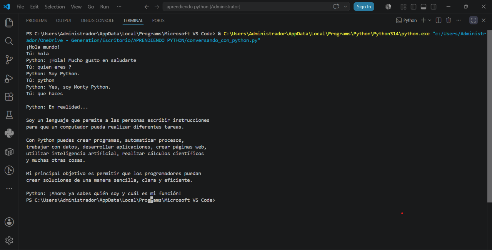

# 🐍 Conversando con Python
Versión 1.0

## 💬 Una experiencia interactiva de conversación desarrollada en Python

**Conversando con Python** es un proyecto interactivo desarrollado en Python que simula una conversación entre el usuario y el programa mediante preguntas y respuestas.

El proyecto fue creado como parte de mi proceso de aprendizaje en programación, con el objetivo de poner en práctica conceptos fundamentales de Python y fortalecer mis habilidades de lógica y resolución de problemas.

---

## 📌 Descripción

Este programa permite al usuario interactuar con Python a través de una serie de preguntas.

Durante la ejecución, el programa solicita información al usuario, procesa sus respuestas y genera distintas respuestas según las opciones seleccionadas.

La interacción busca mostrar de una manera sencilla y dinámica cómo un programa puede recibir información, analizarla y responder utilizando estructuras básicas de programación.

---

## 🎯 Objetivos del proyecto

* Practicar los fundamentos del lenguaje Python.
* Fortalecer el pensamiento lógico y la resolución de problemas.
* Comprender el uso de variables y datos ingresados por el usuario.
* Implementar estructuras condicionales.
* Crear una experiencia interactiva mediante la consola.
* Aplicar buenas prácticas durante el desarrollo de un proyecto.


---
## 🛠️ Tecnologías utilizadas

- 🐍 **Python 3**
- 💻 **Visual Studio Code**
- 🌐 **GitHub**

---

## ⚙️ Conceptos de programación aplicados

Durante el desarrollo del proyecto se utilizaron diferentes conceptos fundamentales de Python:

- Variables
- Entrada de datos mediante `input()`
- Salida de información mediante `print()`
- Estructuras condicionales `if`, `elif` y `else`
- Métodos `.lower()` y `.strip()`
- Comparación de datos
- Lógica de programación
- Interacción con el usuario

---

## 🚀 ## ⚙️ Funciones del programa

El programa **Conversando con Python** permite interactuar con el usuario mediante una conversación sencilla desde la consola.

Entre sus principales funcionalidades se encuentran:

* 🗣️ **Interacción con el usuario:** permite ingresar información mediante el teclado.
* 👋 **Saludo inicial:** inicia la conversación con un mensaje de bienvenida.
* 🧑 **Identificación del usuario:** solicita información al usuario para personalizar la conversación.
* 💬 **Respuestas interactivas:** procesa las respuestas ingresadas y muestra diferentes mensajes.
* 🤖 **Simulación conversacional:** representa una conversación básica entre el usuario y Python.
* 🚪 **Finalización de la conversación:** permite terminar la interacción cuando el usuario lo indica.


---

## 🚀 Cómo ejecutar el proyecto

Para ejecutar el programa **Conversando con Python**, sigue estos pasos:

### 1. Clonar el repositorio

Abre una terminal y ejecuta:

```bash
git clone https://github.com/yeudis/conversando-con-Python.git
```

### 2. Ingresar a la carpeta del proyecto

```bash
cd conversando-con-Python
```

### 3. Ejecutar el programa

```bash
python conversando-con-Python.py
```

> 💡 Si el comando `python` no funciona en tu equipo, puedes intentar con:

```bash
python3 conversando-con-Python.py
```

### 4. Interactuar con el programa

Una vez ejecutado, el programa mostrará mensajes en la consola y podrás responder las preguntas escribiendo directamente desde el teclado.

## 📸 Demostración

A continuación se muestra el programa en funcionamiento:


